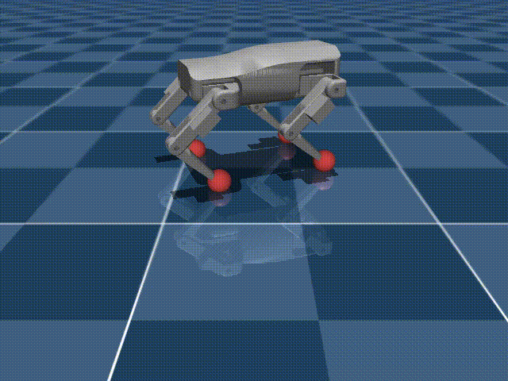

# Quadruped RL — Locomotion with MuJoCo + PPO



Train a 12-DOF quadruped to walk in simulation, then drive it live with the keyboard.

This repo has **two tracks**:
1. **Unitree A1 + Stable-Baselines3 (CPU)** — the original pipeline; good for learning the
   fundamentals from scratch, but slow (hours per curriculum phase).
2. **Custom dog + JAX/MJX + Brax PPO (GPU)** — a custom 12-DOF robot (converted from a
   Fusion360 URDF) trained in a Colab notebook in minutes, then driven locally with the
   keyboard. See [Custom Dog](#custom-dog--jaxmjx) below.

---

## Project Structure

```
quadruped_rl/
├── env/
│   ├── quadruped_env.py   # Gymnasium environment
│   ├── rewards.py         # Individual reward term functions
│   ├── controller.py      # Joint position controller
│   └── commands.py        # Velocity command sampler
├── assets/
│   └── generate_model.py  # Legacy — not used (see Robot Model below)
├── models/                # Saved checkpoints (gitignored)
├── logs/                  # TensorBoard logs (gitignored)
├── config.py              # All tunable parameters
├── train.py               # PPO training script
├── eval.py                # Load & visualise a trained policy
├── watch_training.py      # Watch a checkpoint mid-training
├── view.py                # Viewer: `python view.py` (A1) or `python view.py --dog`
├── joystick_control.py    # Keyboard/gamepad control of the SB3 A1 policy
│
├── dog_locomotion.ipynb   # Colab notebook: train the custom dog (JAX/MJX + Brax PPO)
├── dog_joystick.py        # Keyboard control of the trained dog policy
├── assets/dog.xml         # Custom dog MJCF (+ dog_scene.xml, dog.urdf, meshes/)
└── requirements.txt
```

---

## Setup

```bash
# 1. Create venv
python3 -m venv venv
source venv/bin/activate

# 2. Install dependencies
pip install -r requirements.txt

# 3. Install CUDA PyTorch (check nvidia-smi for CUDA version)
pip install torch --index-url https://download.pytorch.org/whl/cu126

# 4. Clone the Unitree A1 model from MuJoCo Menagerie (one level up from project root)
git clone --filter=blob:none --sparse https://github.com/google-deepmind/mujoco_menagerie.git ../mujoco_menagerie
cd ../mujoco_menagerie && git sparse-checkout set unitree_a1 && cd ../quadruped_rl
```

---

## Robot Model

Uses the **official Unitree A1** from [MuJoCo Menagerie](https://github.com/google-deepmind/mujoco_menagerie).
The environment automatically loads `scene.xml` (which includes the floor and lighting).

Key difference from typical RL setups: the A1 uses **built-in position actuators** (Kp=100).
The policy outputs joint position offsets — the model's actuators handle the PD internally.

---

## Training

```bash
# Fresh run (CPU is faster than GPU for this MLP policy)
python train.py --n_envs 8 --device cpu

# Resume from a checkpoint
python train.py --n_envs 8 --device cpu --resume models/best/best_model.zip

# Custom timestep budget
python train.py --n_envs 8 --device cpu --timesteps 20000000
```

Monitor training:
```bash
tensorboard --logdir logs/tensorboard
```

Checkpoints are saved to `models/` every 500k steps alongside `_vecnorm.pkl` files.
The best policy (by eval return) is saved to `models/best/best_model.zip`.

### Training Strategy — Curriculum

The policy is trained in phases with gradually expanding command ranges.
**Never jump ranges too quickly — the policy will regress to standing still.**

| Phase | CMD_VX | CMD_VY | CMD_YAW | Stop when... |
|-------|--------|--------|---------|--------------|
| 1 — forward | (0.5, 1.0) | (0, 0) | (0, 0) | `lin_vel_tracking` > 0.7 |
| 2 — slow lateral | (0.3, 1.0) | (-0.05, 0.05) | (0, 0) | Stable, no regression |
| 3 — full lateral | (0.3, 1.0) | (-0.2, 0.2) | (0, 0) | `lin_vel_tracking` stays high |
| 4 — add yaw | (0.3, 1.0) | (-0.2, 0.2) | (-0.5, 0.5) | Stable |
| 5 — full range | (-1.0, 1.0) | (-0.5, 0.5) | (-1.0, 1.0) | Final |

Watch `reward_terms/lin_vel_tracking` in TensorBoard. If it drops after a resume and
doesn't recover within ~2M steps, the range jump was too large — stop and try a smaller step.

---

## Watching Training Progress

```bash
# Watch the latest checkpoint (shows commanded vs actual velocity)
python watch_training.py

# Specific checkpoint
python watch_training.py --model models/ppo_quadruped_5000000_steps.zip

# Stochastic mode (matches training behaviour)
python watch_training.py --stochastic
```

Output:
```
Episode 1  (deterministic)
   cmd_vx   cmd_vy   act_vx   act_vy
     0.75     0.00     0.71     0.01
  --- Episode 1 done (1000 steps) ---
  avg cmd:    vx=0.75  vy=0.00
  avg actual: vx=0.68  vy=0.01
```

---

## Evaluation

```bash
python eval.py
python eval.py --model models/ppo_quadruped_5000000_steps.zip --episodes 5
```

---

## Joystick / Keyboard Control

```bash
python joystick_control.py --keyboard
```

| Key   | Command        |
|-------|----------------|
| W / S | Forward / Back |
| A / D | Strafe L / R   |
| Q / E | Rotate L / R   |
| Space | Stop           |
| Esc   | Quit           |

Note: lateral and yaw commands only work well once the policy has been trained on
those command ranges (phases 3+ above).

---

## Reward Function

All weights are in `config.py → REWARD_WEIGHTS`:

| Term | Weight | Purpose |
|------|--------|---------|
| `lin_vel_tracking` | 3.0 | Match commanded vx/vy — dominant objective |
| `yaw_rate_tracking` | 1.0 | Match commanded yaw rate |
| `upright` | 0.5 | Stay upright |
| `base_height` | 0.2 | Maintain target height |
| `torque_penalty` | -0.00002 | Energy efficiency (keep small — A1 actuators produce large torques) |
| `action_smoothness` | -0.01 | Reduce joint vibration |
| `foot_slip` | -0.05 | Encourage proper foot lifting |

Reward functions live in `env/rewards.py` and are fully independent.
Velocity tracking uses a Gaussian with `sigma=0.5` — wider than typical to provide
a useful gradient signal when the robot is learning from rest.

---

## Observation Space (45 dims)

| Index | Content | Scale |
|-------|---------|-------|
| 0–2 | Base angular velocity (body frame) | × 0.25 |
| 3–5 | Projected gravity vector | × 1.0 |
| 6–8 | Commanded velocity (vx, vy, yaw) | × 1.0 |
| 9–20 | Joint positions (Δ from default) | × 1.0 |
| 21–32 | Joint velocities | × 0.05 |
| 33–44 | Previous action | × 1.0 |

Linear velocity is converted to **body frame** before comparing against commands.

---

## Architecture & Limitations

This project uses **Stable-Baselines3 + standard MuJoCo on CPU**. It works, but has
significant training speed limitations compared to the JAX/MJX approach used by
DeepMind's [MuJoCo Playground](https://github.com/google-deepmind/mujoco_playground).

| | This project | JAX/MJX (Playground) |
|--|--|--|
| Parallel envs | 8 (CPU) | 4096+ (GPU) |
| 10M steps | ~2–3 hours | ~1–2 minutes |
| Full vx/vy/yaw training | Needs curriculum | From step 1 |

**For a new project, start with MuJoCo Playground.** The `Go1JoystickFlatTerrain`
environment is the closest equivalent and trains in ~7 minutes on an RTX 4090.
This repo is useful for understanding the fundamentals of quadruped RL from scratch.

---

## Custom Dog — JAX/MJX

A custom 12-DOF quadruped (converted from a Fusion360 `dog.urdf`, 2 kg, position
actuators) trained with the fast JAX/MJX + Brax PPO stack.

### Train (Colab)

Open `dog_locomotion.ipynb` in Colab (GPU runtime). It installs JAX/MuJoCo/Playground,
clones this repo for the model + meshes, defines a self-contained `DogJoystickEnv`
(a port of Playground's Go1 joystick task), trains, and renders a rollout. Export the
policy at the end:

```python
from brax.io import model
model.save_params('dog_policy', params)
from google.colab import files; files.download('dog_policy')
```

### Drive it locally with the keyboard

```bash
pip install "jax[cpu]" brax     # one-time; CPU is plenty for a tiny MLP at 50 Hz
python dog_joystick.py          # place dog_policy in the repo root first
```

| Key | Action |
|-----|--------|
| ↑ / ↓ | forward / back |
| ← / → | strafe left / right |
| , / . | turn left / right |
| Space | stop · **R** reset · **Esc** quit |

At zero command the robot holds its standing pose (no idle jitter); pass
`--no-hold-still` to always run the policy.

### Gotchas worth knowing

- **MJX solver settings dominate speed.** `dog.xml` sets `iterations="1"
  ls_iterations="5"` + Euler. MJX runs a fixed iteration count per step, so MuJoCo's
  CPU defaults (100 / 50) are ~100× too slow. This was the biggest performance bug.
- **Brax stores the observation normalizer separately from the weights.** Rebuild
  inference with `preprocess_observations_fn=running_statistics.normalize`, or the
  policy gets raw observations and tracks commands poorly (it'll still stand upright,
  which makes the bug sneaky). This is the #1 Brax deployment trap.

---

## Requirements

- Python 3.10+
- MuJoCo 3.x
- See `requirements.txt` for full list
